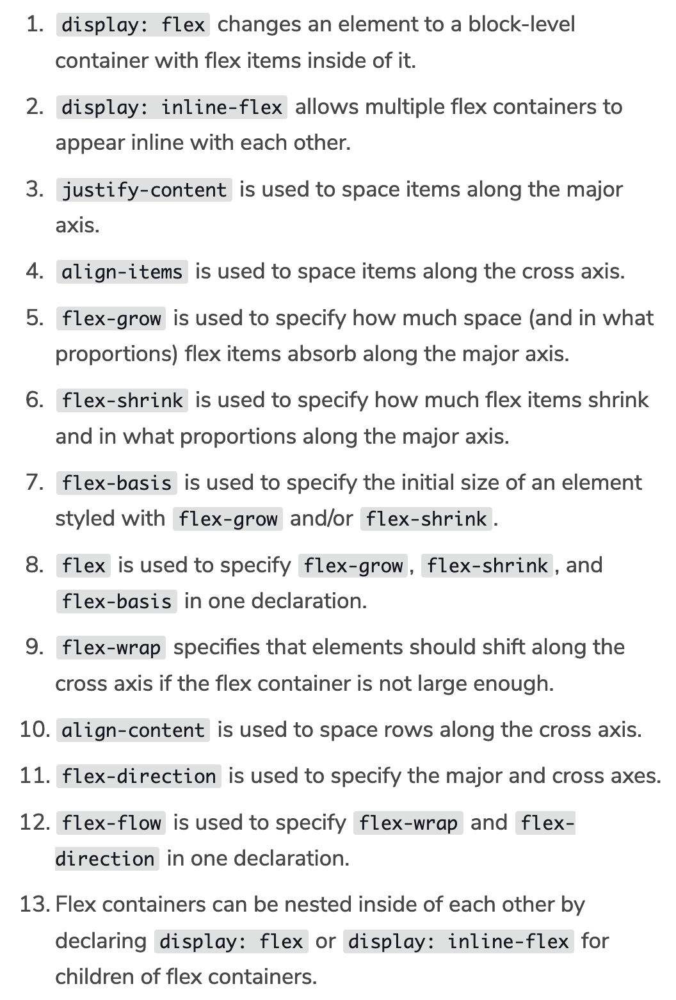

# Flexbox Introduction

## How to declare a container as flex

**Example:** `display: inline-flex;`

## Justify content

Define how the individual items in a container should a aligned from left to right

**Example**: `justify-content: flex, flex-start, flex-end, center, space-around, space-between;`

## Align items

Define how the individual items should be aligned from tosp to bottom

**Example:** `align-item: flex-start, flex-end, center, baseline, stretch;`

## Flex grow - Flex Item

Define how much an item should grow. Defined on item, not on container basis.

**Example:** `flex-grow: 2;` *Default value is 1*

## Flex shrink - Flex Item

Define how much an item should shrink.

**Example:** `flex-shrink: 2;`

## Flex basis - Flex Item

Defines a basis for the flex item before it shrinks or grows.

**Example:** `flex-basis: 150px;`

## Flex property - Flex Item

It is possible to define grow, shrink and basis in one line with the flex property.
This is not the same as the `display: flex;` declaration;

**Example:** `flex: 2 1 150px;` defines an element to grow at 2, shrink at 1 and have a basis of 150px.

## Flex wrap

If the elements should now always fit the container we can define with `flex-wrap` how they should wrap in the next line.
This property is defined on the flex container.

**Example:** `flex-wrap: wrap, wrap-reverse, nowrap` *nowrap is the default setting*

## Align content

If a flex container has more rows, it is possible to define the spacing of elements from top to bottom.
This property is defined on the flex container.

**Example:** `align-content: flex-start, flex-end, center, space-between, space around, stretch`

### Summary up until now

Flexbox has two axis: the horizontal (major axis by default) and vertical axis and different methods to position content on the page.
It is possible to change the major axis with `flex-direction: column, row, column-reverse, row-reverse;`

#### Horizontal

* justify-content
* flex-wrap
* flex-grow
* flex-shrink

#### Vertical

* align-items
* align-content

## Flex flow

Defines the values for flex direction and flex-wrap in the same line.

**Example:** `flex-flow: column wrap;` *Defines flex-direction as column and flex-wrap as wrap*

### Summary of chapter

