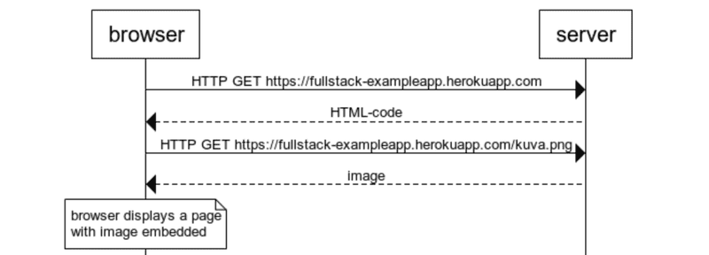
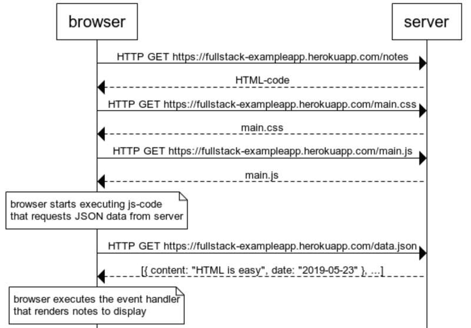

# Part 0 - Fundamentals of Web Apps

## Getting content from a sample Web App



[Example of a request](https://fullstack-exampleapp.herokuapp.com/) analyzed via the Developer Console - Network in Chrome/Firefox.

### Event Handlers and Callback functions

In the sample web app there is a JS script that fetches the notes from a .json that is on the same domain.

```
var xhttp = new XMLHttpRequest()
  
xhttp.onreadystatechange = function () {
  if (this.readyState == 4 && this.status == 200) {
    const data = JSON.parse(this.responseText)
    console.log(data)

    var ul = document.createElement('ul')
    ul.setAttribute('class', 'notes')

    data.forEach(function(note){
      var li = document.createElement('li')
      
      ul.appendChild(li);
      li.appendChild(document.createTextNode(note.content))
    })

    document.getElementById("notes").appendChild(ul)
  }
}

xhttp.open("GET", "/data.json", true)
xhttp.send()
```

The line `xhttp.onreadystatechange` is an event with the callback function `function() { ... }` that checks if the operation is finished (readyState == 4) and if the HTTP Code 200 is returned.

The new flowchart of the `/notes` subfolder:



### Notes App as a SPA - Single Page Application

In the SPA we don't have a redirect and not a reload of the entire page. This is achieved by suppressing the form's default behaviour via `e.preventDefault()`.

Also the data is redrawn dynamically by the javascript instead of realoding the entire page.

This is achieved by the following JS code:

```
var notes = []

var redrawNotes = function() {
  var ul = document.createElement('ul')
  ul.setAttribute('class', 'notes')

  notes.forEach(function (note) {
    var li = document.createElement('li')

    ul.appendChild(li);
    li.appendChild(document.createTextNode(note.content))
  })

  var notesElement = document.getElementById("notes")
  if (notesElement.hasChildNodes()) {
    notesElement.removeChild(notesElement.childNodes[0]);
  }
  notesElement.appendChild(ul)
}

var xhttp = new XMLHttpRequest()

xhttp.onreadystatechange = function () {
  if (this.readyState == 4 && this.status == 200) {
    notes = JSON.parse(this.responseText)
    redrawNotes()
  }
}

xhttp.open("GET", "/data.json", true)
xhttp.send()

var sendToServer = function (note) {
  var xhttpForPost = new XMLHttpRequest()
  xhttpForPost.onreadystatechange = function () {
    if (this.readyState == 4 && this.status == 201) {
      console.log(this.responseText)
    }
  }

  xhttpForPost.open("POST", '/new_note_spa', true)
  xhttpForPost.setRequestHeader("Content-type", "application/json")
  xhttpForPost.send(JSON.stringify(note));
}

window.onload = function (e) {
  var form = document.getElementById("notes_form")
  form.onsubmit = function (e) {
    e.preventDefault()

    var note = {
      content: e.target.elements[0].value,
      date: new Date()
    }

    notes.push(note)
    e.target.elements[0].value = ""
    redrawNotes()
    sendToServer(note)
  }
}
```